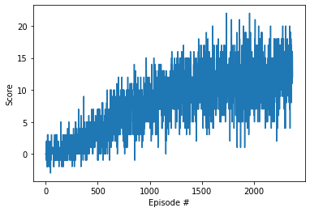

## Learning Algorithm

The network was trained with DQN using 3 layer network with PyTorch layers:

1. Linear(64,128)
2. Linear(128,64)
3. Linear(64,4).

The results are provided in ```Navigation-Solution.ipynb```
The application can be also run with python-script ```main.py```.


Network hyperparameters:

```

BUFFER_SIZE = int(1e5)  # replay buffer size
BATCH_SIZE = 64         # minibatch size
GAMMA = 0.99            # discount factor
TAU = 1e-3              # for soft update of target parameters
LR = 5e-4               # learning rate
UPDATE_EVERY = 4        # how often to update the network
```

Training hyperparameters:
```
n_episodes=10000 - maximum number of training episodes
max_t=1000 -  maximum number of timesteps per episode
eps_start=1.0 - starting value of epsilon, for epsilon-greedy action selection
eps_end=0.01 - minimum value of epsilon
eps_decay=0.999 - multiplicative factor (per episode) for decreasing epsilon
         
```

## Progress

```
Episode 100	Average Score: 0.15 eps 0.90
Episode 200	Average Score: 0.45 eps 0.82
Episode 300	Average Score: 1.28 eps 0.74
Episode 400	Average Score: 2.07 eps 0.67
Episode 500	Average Score: 3.17 eps 0.61
Episode 600	Average Score: 3.69 eps 0.55
Episode 700	Average Score: 5.23 eps 0.50
Episode 800	Average Score: 6.05 eps 0.45
Episode 900	Average Score: 7.07 eps 0.41
Episode 1000	Average Score: 7.51 eps 0.37
Episode 1100	Average Score: 8.47 eps 0.33
Episode 1200	Average Score: 8.50 eps 0.30
Episode 1300	Average Score: 10.19 eps 0.27
Episode 1400	Average Score: 10.06 eps 0.25
Episode 1500	Average Score: 10.68 eps 0.22
Episode 1600	Average Score: 11.03 eps 0.20
Episode 1700	Average Score: 10.98 eps 0.18
Episode 1800	Average Score: 11.58 eps 0.17
Episode 1900	Average Score: 10.94 eps 0.15
Episode 2000	Average Score: 11.91 eps 0.14
Episode 2100	Average Score: 12.30 eps 0.12
Episode 2200	Average Score: 11.17 eps 0.11
Episode 2300	Average Score: 12.46 eps 0.10
Episode 2371	Average Score: 13.01 eps 0.09
Environment solved in 2271 episodes!	Average Score: 13.01
```

##Plot of Rewards




The evaluation for trained is agent is above required 13.00 score:

```Episode 100	Average Score: 14.56 eps 0.00```


##Ideas for Future Work
Add full visual raw pixels for neural network, as it will increase the agent performance, but will require longer training. 

